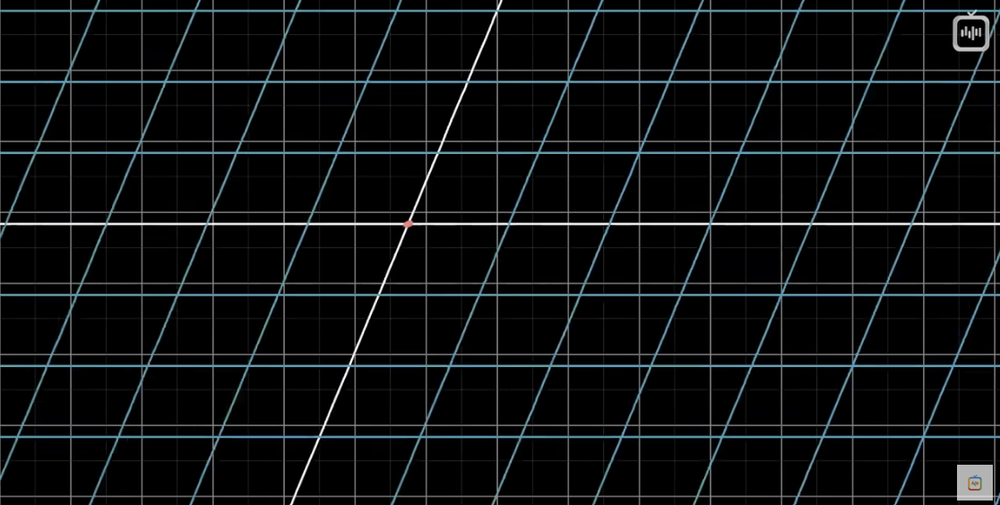

<blockquote>Использование чисел в качестве координат — акт насилия. Hermann Weyl</blockquote>

## Векторы

[ Конспект "Суть линейной алгебры: #1"](https://www.youtube.com/watch?v=cJslkj9_wyg)

* _Вектор_
* _Координаты вектора_
* _Сложение векторов_
* _Умножение векторов_

<mark>Вектор</mark> — направленный отрезок. Обозначается парой чисел в квадратных скобках, расположенных вертикально. Точка же описывается парой чисел в круглых скобках, расположенных горизонтально.

```graph
bounds: [-5, 5, 5, -5]
keepAspectRatio: false
drag: false
showNavigation: false
height: 400
width: 500
elements: [
	{type: arrow, def: [[0, 0], [2, 2]]},
	{type: text, def: [0.4, 1.15, l]},
	{type: text, def: [0.4, 0.9, l]},
	{type: text, def: [0.8, 1.15, l]},
	{type: text, def: [0.8, 0.9, l]},
	{type: text, def: [0.55, 1.2, 2]},
	{type: text, def: [0.55, 0.9, 2]},

	{type: point, def: [3, 3]},
	{type: text, def: [3.5, 3.5, '(3, 3)']},
	]
```
$$
\vec{AB} = \begin{bmatrix}
2 \\
2
\end{bmatrix}
;
A = (3, 3)
$$
### Физика

* С точки зрения , векторы — стрелки, имеющие направление в пространстве. Характеристики, определяющие вектор: длина и направление. Если они неизменны, то вектор можно перемещать куда угодно и это будет тот же вектор.

```graph
bounds: [-5, 5, 5, -5]
keepAspectRatio: false
drag: false
showNavigation: false
height: 400
width: 500
elements: [
	{type: arrow, def: [[0, 0], [2, 2]]},
	{type: text, def: [2, 2, B]},
	{type: text, def: [0, 0, A]}
	]
```

### Информатика

* С точки зрения информатики, вектор — упорядоченный список чисел. Можно сказать, что _вектор_ — другой способ назвать упорядоченный список (sorted list).
$$
\vec{AB} = \begin{bmatrix}
0 \\
-3 \\
-5
\end{bmatrix}
$$

### Математика

* Математика обобщает обе точки зрения, утверждая, что векторами могут быть любые объекты, для которых заданы правила сложения их между собой и умножения вектора на число. В линейной алгебре вектор практически всегда вырастает из начала координат.

```graph
bounds: [-5, 5, 5, -5]
keepAspectRatio: false
drag: false
showNavigation: false
height: 400
width: 500
elements: [
	{type: arrow, def: [[0, 0], [1, 1.5]]},
	{type: arrow, def: [[1, 1.5], [3, 2]]},
	{type: arrow, def: [[0, 0], [3, 2]], att: {strokeColor: red}},
	{type: text, def: [3, 2, B]},
	{type: text, def: [0.1, -0.2, A]}
	]
```
$$
\begin{bmatrix}
1 \\
1.5
\end{bmatrix}
+
\begin{bmatrix}
2 \\
0.5
\end{bmatrix}
=
\begin{bmatrix}
1 + 2 \\
1.5 + 0.5
\end{bmatrix}
$$
___

```graph
bounds: [-5, 5, 5, -5]
keepAspectRatio: false
drag: false
showNavigation: false
height: 400
width: 500
elements: [
	{type: arrow, def: [[0, 0], [1, 1]]},
	{type: arrow, def: [[0, 0], [2, 2]], att: {strokeColor: red}},
	{type: text, def: [0.15, 0.6, 2x]},
	]
```
$$
2\begin{bmatrix}
1 \\
1
\end{bmatrix}
=
\begin{bmatrix}
2(1) \\
2(1)
\end{bmatrix}
=
\begin{bmatrix}
2 \\
2
\end{bmatrix}
$$
___

<mark>Координаты вектора</mark> — пара чисел, которые указывают, как добраться от хвоста (начала координат), до его конца.

#### Сложение векторов

В визуальном представлении, для того, чтобы сложить два вектора идущих от начала координат, необходимо перенести начало одного из векторов к концу другого

```graph
bounds: [-1, 3, 7, -1]
keepAspectRatio: false
drag: false
showNavigation: false
height: 400
width: 500
elements: [
	{type: arrow, def: [[0, 0], [1, 1.5]]},
	{type: arrow, def: [[0, 0], [2, 0.5]]},
	{type: text, def: [2.2, 1, =]},

	{type: arrow, def: [[2, 0], [3, 1.5]]},
	{type: arrow, def: [[3, 1.5], [5, 2]]},
	{type: arrow, def: [[2, 0], [5, 2]], att: {strokeColor: red}},
	]
```
$$
\begin{bmatrix}
1 \\
1.5
\end{bmatrix}
+
\begin{bmatrix}
2 \\
0.5
\end{bmatrix}
=
\begin{bmatrix}
3 \\
2
\end{bmatrix}
$$
___
#### Умножение векторов

При умножении вектора на число, графически мы изменяем его длину. Процесс умножения иначе называется <mark>масштабированием</mark>, а число, на которое умножается вектор — <mark>скаляр (scalar — scale)</mark>.

```graph
bounds: [-1, 5, 9, -1]
keepAspectRatio: false
drag: false
showNavigation: false
height: 400
width: 500
elements: [
	{type: arrow, def: [[0, 0], [3, 2]]},
	{type: text, def: [2.2, 1, 'x2 =']},

	{type: arrow, def: [[2, 0], [8, 4]], att: {strokeColor: red}},
	]
```
$$
2 \times \begin{bmatrix}
3 \\
2
\end{bmatrix}
=
\begin{bmatrix}
3 \times 2 \\
2 \times 2
\end{bmatrix}
=
\begin{bmatrix}
6 \\
4
\end{bmatrix}
$$
Каждое значение вектора можно представить как скаляр, каждое из которых растягивает или сжимает вектор
$$
\begin{bmatrix}
3 - скаляр \\
2 - скаляр
\end{bmatrix}
$$
___
## Линейная комбинация, линейная оболочка и базисные векторы

[Конспект "Суть линейной алгебры: #2"](https://www.youtube.com/watch?v=W8tQU4YhkQo)

* _Базис и базисные векторы_
* _Линейная комбинация_
* _Линейная оболочка_
* _Линейная зависимость (коллинеарность)_
* _Скаляр_

В системе координат XY есть два очень важных вектора (так же называются <mark>базис</mark> или <mark>базисные векторы</mark>): 
* i - направлен вправо и длиной в единицу (единичный вектор по оси X)
* j - направлен вверх и длиной в единицу (единичный вектор по оси Y)

Теперь представим, что координата X нашего вектора — это <mark>скаляр</mark>, который масштабирует вектор i <mark>(базис)</mark>, растягивая его в три раза, а координата Y — это скаляр, который масштабирует вектор j <mark>(базис)</mark> и переворачивает его. При таком подходе, вектор, который описывается двумя координатами, это сумма двух масшабированных векторов

```graph
bounds: [-3, 4, 4, -4]
keepAspectRatio: false
drag: false
showNavigation: false
height: 400
width: 500
elements: [
	{type: arrow, def: [[0, 0], [3, -2]], att: { strokeColor: 'red' }},
	{type: arrow, def: [[0, 0], [1, 0]]},
	{type: arrow, def: [[0, 0], [0, 1]]},
	{type: text, def: [0.4, 0.3, 'i']},
	{type: text, def: [-0.2, 0.5, 'j']},
	{type: text, def: [2, -2, '(3)i+(-2)j']},
	]
```
$$
\begin{bmatrix}
3 \\
-2
\end{bmatrix}
=
(3)i+(-2)j
$$

Любое численное описание векторов зависит от того, какие базисные векторы мы взяли. Любая операция, при которой мы масштабируем два вектора и складываем их, называется <mark>линейной комбинацией</mark> этих векторов. При этом изменяя значения скаляров этих векторов, мы можем "дотянуться" до любой точки на графике. Исключением будут два вектора, лежащих на одной прямой — тогда изменение скаляров будет только увеличивать длину результирующего вектора.

Множество векторов, которые получаются с помощью <mark>линейной комбинации</mark> заданной пары векторов, называется <mark>линейной оболочкой</mark> этих векторов.  _<mark>Линейная оболочка</mark> большинства пар двумерных векторов охватывает все пространство_

Из-за возможной визуальной загруженности, векторы часто изображают точками на графике, которые соответствуют концам этих векторов (при условии, что вектор растет из начала координат). _Если речь идет об одном векторе, то его лучше представить в виде прямой. Если же речь идет о множестве векторов, то удобнее представлять их в виде точек._

```graph
bounds: [-3, 4, 4, -4]
keepAspectRatio: false
drag: false
showNavigation: false
height: 400
width: 500
elements: [
	{type: point, def: [1, 1]},
	{type: point, def: [2, 1]},
	{type: point, def: [3, 2]},
	{type: point, def: [-1, 2]},
	
	]
```

В трехмерном пространстве, если два вектора лежат на одной линии, а третий вектор нет — <mark>линейная оболочка</mark> все равно охватит все пространство, так как третий вектор "протянет" плоскость двух первых векторов через все пространство.

С другой стороны, если третий вектор лежит в плоскости первых двух, то один из трех векторов <mark>избыточен</mark> и не добавляет ничего к нашей <mark>линейной оболочке</mark>. Если один из векторов можно убрать, не уменьшив линейную оболочку, то говорят, что векторы <mark>линейно зависимы (коллинеарны)</mark>. Другими словами, один из векторов можно выразить как комбинацию остальных, ведь он лежит в их линейной оболочке.

Если же новый вектор увеличивает размерность линейной оболочки, такие векторы называются <mark>линейно независимыми (неколлинеарны)</mark>.

```graph
bounds: [-10, 10, 10, -10]
bounds3d: [[-2,8], [-5,5], [-5,5]]
axis: false
keepAspectRatio: true
elements: [ 
	{type: line3d, def: [[0,0,0], [1,2,0]]},
	{type: line3d, def: [[0,0,0], [2,1,0]]},
	{type: line3d, def: [[0,0,0], [0,1,2]]},
	{type: plane3d, def: [[0, 0, 0], [1,2,0],[2, 1, 0]]},
	{type: plane3d, def: [[0, 0, 0], [1,2,0],[0, 1, 2]]},
	{type: plane3d, def: [[0, 0, 0], [2,1,0],[0, 1, 2]]},
]
```
<center>
На 3d графике можно видеть 3 плоскости, образованные парами векторов, которые можно протянуть через все пространство, изменяя скаляры векторов.
</center>

 <blockquote>Базис пространства — это набор неколлинеарных векторов, чья линейная оболочка формирует это пространство.</blockquote>

## Линейные преобразования и матрицы

[Конспект "Суть линейной алгебры: #3"](https://www.youtube.com/watch?v=fXNPMs1ZgTI)

<blockquote>Увы, невозможно объяснить, что такое матрица. Ты должен увидеть ее сам. Morpheus.</blockquote>

* _Линейное преобразование (Linear transformation)_ 
* _Преобразование пространства_

<mark>Линейное преобразование</mark> — просто красивое название для <mark>функции</mark>. Функция преобразовывает линейные данные по неким правилам. Математики используют термин "Линейное преобразование" просто потому, что так чуть понятнее, что функция делает с данными. Можно так же сказать, что линейное преобразование векторов в новые — перемещение каждой точки пространства (точкой считать конец вектора) на новое место. 

В математике, в основном, использую такие преобразования, при которых сетка, образованная векторами, не изгибается (линии сетки остаются <mark>прямыми, параллельными и равноудаленными</mark>). В случае, если линии искривляются, такое преобразование не является линейным.

|                   |  |  |
| ------------------------------------------------------- | ------------------------------------------ | -------------------------------------------------- |
| Без преобразования (Пересечения линий — концы векторов) | <mark>Линейное преобразование</mark>       | Нелинейное преобразование                          |

_Как выяснить формулу линейного преобразования, если векторов много?_ Достаточно вычислить, где окажутся два базисных вектора i и j, а остальные векторы можно вычислить через них.

Возьмем вектор `v = -1i + 2j`. Если мы используем какое-нибудь линейное преобразование, то тот факт, что линии сетки остаются параллельными и равноудаленными, будет иметь одно очень полезное следствие: вектор `v` останется все той же комбинацией базисных векторов, но уже преобразованных базисных векторов. Это значит, мы можем узнать куда попадет вектор `v`, зная, куда попали `i` и `j`.

```graph
bounds: [-3, 4, 6, -4]
keepAspectRatio: false
drag: false
showNavigation: false
height: 400
width: 500
elements: [
	{type: arrow, def: [[0, 0], [1, 0]], att: { color: violet }},
	{type: arrow, def: [[0, 0], [0, 1]], att: { color: violet }},
	{type: arrow, def: [[0, 0], [-1, 2]], att: { strokeColor: blue }},
	{ type: text, def: [0.5, -0.2, 'i'], att: { color: violet }},
	{ type: text, def: [0.2, 0.5, 'j'], att: { color: violet }},
	{ type: text, def: [-1.5, 1, 'вектор V'], att: { color: blue }},

	{type: arrow, def: [[0, 0], [1, -2]], att: { strokeColor: green }},
	{type: arrow, def: [[0, 0], [3, 0]], att: { strokeColor: green }},
	{type: arrow, def: [[0, 0], [5, 2]], att: { strokeColor: yellow }},
	{ type: text, def: [0.7, -1, 'i new'], att: { color: green }},
	{ type: text, def: [1.5, 0.2, 'j new'], att: { color: green }},
	{ type: text, def: [1.5, 1.2, 'вектор V new'], att: { color: yellow }},
	]
```

![[linear-transform-example-1.png]]
<center>
На изображении видна изначальная сетка и сетка после линейного преобразования (косые линии). Ориентируясь по изначальной сетке, мы можем вычислить положение вектора V после преобразования базисных векторов i и j.
</center>
$$
\begin{array}
\vec{V} = -1i + 2j
\\
\text{Transformed v = -1(Transformed i) + 2(Transformed j)}
\\ 
\vec{Vnew} = -1\times \begin{bmatrix}
1 \\ -2
\end{bmatrix} +  
2 \times \begin{bmatrix}
3 \\ 0
\end{bmatrix} = \begin{bmatrix}
5 \\ 2
\end{bmatrix}
\end{array}
$$
Из всего этого мы можем понять, что положение любого вектора [x y] мы можем вычислить, зная преобразования базисных векторов (иначе говоря, новые координаты базисных векторов после преобразования). Таким образом мы можем преобразовать любой вектор.
$$
\begin{bmatrix}
x \\ y
\end{bmatrix}
\to
x \begin{bmatrix}
1 \\ -2
\end{bmatrix}
+
y\begin{bmatrix}
3 \\ 0
\end{bmatrix}
=
\begin{bmatrix}
1x + 3y \\ -2x + 0y
\end{bmatrix}
$$
<blockquote>Двумерное линейное преобразование можно описать всего четыремя числами: двумя координатами вектора i и двумя координатами вектора j, которое записывается матрицей 2x2. Каждая такая матрица — описание преобразования пространства (линейное преобразование)</blockquote>
$$
\begin{array}
-\begin{bmatrix}
3 & 2 \\
-2 & 1
\end{bmatrix} \\
\begin{bmatrix}
3 \\
-2
\end{bmatrix} 
\text{ — Координата i после преобразования} \\
\begin{bmatrix}
2 \\
1
\end{bmatrix} 
\text{ — Координата j после преобразования}
\end{array}
$$
![[../assets/vector/where-i-and-j-lands.png]]
<center>Матрица преобразование и удобное для запоминания представление ее столбцов (это представление очень полезно в перемножении матриц и композиции преобразования (следующая лекция под номером 4)</center>

Рассмотрим общий случай линейного преобразования вектора или другими словами <mark>умножения матрицы на вектор</mark>:
$$
\begin{bmatrix}
a & b \\
c & d
\end{bmatrix}
\begin{bmatrix}
x \\
y
\end{bmatrix} = 
x\begin{bmatrix}
a \\
c
\end{bmatrix}
+
y\begin{bmatrix}
b \\
d
\end{bmatrix}=
\begin{bmatrix}
ax +by \\
cx + dy
\end{bmatrix}
$$

<blockquote>Все последующие темы и в целом линейная алгебра станет понятнее, если смотреть на матрицы как на <mark>преобразования пространства</mark></blockquote>

## Произведение матриц, или композиция преобразований

[Конспект "Суть линейной алгебры: #4"](https://www.youtube.com/watch?v=_I03qVUXyF4)

* _Композиция преобразования (composition)_
### Подведение итогов предыдущих лекций:

Линейное преобразование — функция, которая берет один вектор и преобразовывает его в другой, что можно изобразить, как <mark>сжатие</mark> и <mark>растяжение</mark> пространства, при котором <mark>линии сетки остаются параллельными и равноудаленными</mark>, а <mark>начало координат не смещается</mark>.
$$
\begin{array}
\vec{v} = \begin{bmatrix}
5 \\
7
\end{bmatrix} \\
L(\vec{v}) = \begin{bmatrix}
2 \\
-3
\end{bmatrix}
\end{array}

$$
Для описания преобразования достаточно описать, куда переместятся базисные векторы i и j. Любой другой вектор можно описать как <mark>линейную комбинацию</mark> двух базисных векторов
$$
\begin{array}
\vec{v} = \begin{bmatrix}
x \times i\\
y \times j
\end{bmatrix} \\
\vec{vnew} = \begin{bmatrix}
x \times inew \\
y \times jnew
\end{bmatrix}
\end{array}
$$
Новые координаты (после преобразования) базисных векторов принято записывать в матрицы 2х2. Операцию сложения произведений этих столбцов на x и y называют <mark>умножением матрицы на вектор</mark>. Умножение матрицы на ветор — способ математически рассчитать, что произойдет с вектором после преобразования.
$$
\begin{bmatrix}
a & b \\
c & d
\end{bmatrix}
\begin{bmatrix}
x \\
y
\end{bmatrix} = 
x\begin{bmatrix}
a \\
c
\end{bmatrix}
+
y\begin{bmatrix}
b \\
d
\end{bmatrix}=
\begin{bmatrix}
ax +by \\
cx + dy
\end{bmatrix}
$$
### Описание эффекта двух преобразований

Например, мы можем повернуть плоскость на 90 градусов, а затем применить сдвиг. Совокупный эффект двух преобразований можно выразить как новое линейное преобразование, отличающееся от первых двух. Такое сочетание обычно называют <mark>композицией преобразований</mark> (что все еще является линейным преобразованием). Получившаяся матрица описывает совокупный эффект от поворота и сдвига, будто это <mark>одно действие, а не два последовательных</mark>.

![[../assets/vector/4-1.png]]
<center>На изображении представлена композиция преобразования, где сначала базисные векторы были повернуты на 90 градусов, а затем был произведен сдвиг вектора i на единицу вправо</center>

Если к вектору нужно последовательно применить два преобразования, можно пойти долгим путем и сначала умножить вектор на матрицу поворота, а затем — на матрицу сдвига
$$
\begin{bmatrix}
1 & 1 \\
0 & 1
\end{bmatrix}
\begin{pmatrix}


\begin{bmatrix}
0 & -1 \\
1 & 0
\end{bmatrix}
\begin{bmatrix}
x \\
y
\end{bmatrix}
\end{pmatrix}
$$
Однако быстрее умножить вектор на матрицу, задающую композицию этих преобразований. Такой подход применим к любому вектору. Новая матрица описывает то же самое, что и комбинация двух предыдущих. Новую матрицу можно назвать <mark>произведением</mark> или <mark>композицией</mark> двух матриц
$$
\begin{bmatrix}
1 & 1 \\
0 & 1
\end{bmatrix}
\begin{pmatrix}


\begin{bmatrix}
0 & -1 \\
1 & 0
\end{bmatrix}
\begin{bmatrix}
x \\
y
\end{bmatrix}
\end{pmatrix}
=
\begin{bmatrix}
1 & -1 \\
1 & 0
\end{bmatrix}
\begin{bmatrix}
x \\
y
\end{bmatrix}
$$
$$
\begin{bmatrix}
1 & 1 \\
0 & 1
\end{bmatrix}
\begin{bmatrix}
0 & -1 \\
1 & 0
\end{bmatrix}
=
\begin{bmatrix}
1 & -1 \\
1 & 0
\end{bmatrix}
$$
С точки зрения геометрии, перемножение двух матриц — поочередное применение соответствующих преобразований.

<mark>Такие записи перемножения (композиции) читаются справа налево</mark> (сначала выполняется преобразование, представленное правой матрицей, а затем — левой). Это проистекает из того, как мы записываем функции преобразования

![[../assets/vector/4-2.png]]

Еще один пример преобразования:

Вычисляем, куда попадет базисный вектор i. <mark>Когда мы применяем матрицу M1, то новые координаты i задаются первым столбцом матрицы [1 1]</mark>. 
 $$
M_{2} = 
 \begin{bmatrix}
0 & 2 \\
1 & 0
\end{bmatrix};
M_{1} = 
\begin{bmatrix}
1 & -2 \\
1 & 0
\end{bmatrix}
$$
<center>Матрицы преобразования  M1 (поворот) и M2 (сдвиг) </center>
___
$$
\begin{bmatrix}
0 & 2 \\
1 & 0
\end{bmatrix}
\begin{bmatrix}
1 & -2 \\
1 & 0
\end{bmatrix}
=
\begin{bmatrix}
? & ? \\
? & ?
\end{bmatrix}
$$
<center>Композиция преобразований M1 и M2 для расчета</center>
___
$$

\begin{bmatrix}
0 & -1 \\
1 & 0
\end{bmatrix}
\begin{bmatrix}
1 & 0 \\
0 & 1
\end{bmatrix}
=
\begin{bmatrix}
? & ? \\
? & ?
\end{bmatrix}
$$
<center>Вычисляем результат преобразования первой матрицы</center>
___
$$
i = 1\begin{bmatrix}
0 \\
1
\end{bmatrix}
+
0\begin{bmatrix}
-1 \\
0
\end{bmatrix}
=
\begin{bmatrix}
0 \\
1
\end{bmatrix}
$$
<center>Вектор i после преобразования M1</center>
___
$$
j = 0\begin{bmatrix}
0 \\
1
\end{bmatrix}
+
1\begin{bmatrix}
-1 \\
0
\end{bmatrix}
=
\begin{bmatrix}
-1 \\
0
\end{bmatrix}
$$
<center>Вектор j после преобразования M1</center>
___
$$

\begin{bmatrix}
0 & -1 \\
1 & 0
\end{bmatrix}
\begin{bmatrix}
1 & 0 \\
0 & 1
\end{bmatrix}
=
\begin{bmatrix}
0 & -1 \\
1 & 0
\end{bmatrix}
$$
<center> Результат преобразования M1. Доказательство утверждения, что базисные векторы просто принимают координаты первой матрицы преобразования</center>
___

Чтобы узнать, что произойдет после второго преобразования, умножаем матрицу M2 на вектор [1 1], который мы только что получили.
$$
i =
\begin{bmatrix}
0 & 2 \\
1 & 0
\end{bmatrix}
\begin{bmatrix}
1 \\
1
\end{bmatrix}
=
1\begin{bmatrix}
0 \\
1
\end{bmatrix} +
1\begin{bmatrix}
2 \\
0
\end{bmatrix}
= 
\begin{bmatrix}
2 \\
1
\end{bmatrix}
$$
<center>Вычисление положения базисного вектора i</center>
___
$$
j =
\begin{bmatrix}
0 & 2 \\
1 & 0
\end{bmatrix}
\begin{bmatrix}
-2 \\
0
\end{bmatrix}
=
-2\begin{bmatrix}
0 \\
1
\end{bmatrix} +
0\begin{bmatrix}
2 \\
0
\end{bmatrix}
= 
\begin{bmatrix}
0 \\
-2
\end{bmatrix}
$$
<center>Вычисление положения базисного вектора j</center>
___
![[../assets/vector/4-3.png]]

Выполним те же преобразования, но теперь с буквами и представим <mark>формулу преобразования</mark>:
$$
\begin{bmatrix}
a & b \\
c  & d
\end{bmatrix}
\begin{bmatrix}
e & f \\
g & h
\end{bmatrix}
= 
\begin{bmatrix}
ae + bg  & af + cf \\
ce + dg & bh + dh
\end{bmatrix}
$$
<center>Формула преобразования</center>
___
$$
\begin{bmatrix}
a & b \\
c & d
\end{bmatrix}
\begin{bmatrix}
e \\
g
\end{bmatrix}
=
e
\begin{bmatrix}
a \\
c
\end{bmatrix}
+
g\begin{bmatrix}
b \\
d
\end{bmatrix}
=
\begin{bmatrix}
ae + bg \\
ce + dg
\end{bmatrix}
$$
<center>Вектор i</center>
___
$$
\begin{bmatrix}
a & b \\
c & d
\end{bmatrix}
\begin{bmatrix}
f \\
h
\end{bmatrix}
=
f\begin{bmatrix}
a \\
c
\end{bmatrix}
+
h\begin{bmatrix}
b \\
d
\end{bmatrix}
=
\begin{bmatrix}
af+bh \\
cf + dh
\end{bmatrix}
$$
<center>Вектор j</center>
___

![[../assets/vector/4-4.png]]
<center>Формула преобразования двух матриц (композиция преобразования)</center>

<blockquote>Формулу преобразования нужно просто заучить. Это будет проще сделать, если представлять умножение матриц как последовательное применение линейных преобразований, как мы сделали ранее</blockquote>

![[../assets/vector/where-i-and-j-lands.png]]
<center>Напоминание того, как удобно представлять матрицу преобразования</center>
___

<blockquote><mark>Порядок преобразования</mark> (M1xM2 или M2xM1) <mark>важен</mark>. Результат (конечное положение базисных векторов) будет отличаться, если мы сначала применим сдвиг, а затем поворот. </blockquote>

$$
\begin{bmatrix}
1 & 1 \\
0 & 1
\end{bmatrix}
\begin{bmatrix}
0 & -1 \\
1 & 0
\end{bmatrix}
=
\begin{bmatrix}
? & ? \\
? & ?
\end{bmatrix}
$$
$$
i = 0\begin{bmatrix}
1 \\
0
\end{bmatrix}
+
1\begin{bmatrix}
1 \\
1
\end{bmatrix}
=
\begin{bmatrix}
1 \\
1
\end{bmatrix}
$$
$$
j = -1\begin{bmatrix}
1 \\
0
\end{bmatrix}
+
0\begin{bmatrix}
1 \\
1
\end{bmatrix}
=
\begin{bmatrix}
-1 \\
0
\end{bmatrix}
$$
$$
\begin{bmatrix}
1 & 1 \\
0 & 1
\end{bmatrix}
\begin{bmatrix}
0 & -1 \\
1 & 0
\end{bmatrix}
=
\begin{bmatrix}
1  & -1 \\
1 & 0
\end{bmatrix}
$$
<center>Наше первое преобразование. Сначала поворот, затем сдвиг </center>
___
$$
\begin{bmatrix}
0 & -1 \\
1 & 0
\end{bmatrix}
\begin{bmatrix}
1 & 1 \\
0 & 1
\end{bmatrix}
=
\begin{bmatrix}
? & ? \\
? & ?
\end{bmatrix}
$$
$$
i = 1\begin{bmatrix}
0 \\
1
\end{bmatrix}
+
0\begin{bmatrix}
-1 \\
0
\end{bmatrix}
= \begin{bmatrix}
0 \\
1
\end{bmatrix}
$$
$$
j = 1\begin{bmatrix}
0 \\
1
\end{bmatrix}
+
1\begin{bmatrix}
-1 \\
0
\end{bmatrix}
= \begin{bmatrix}
-1 \\
1
\end{bmatrix}
$$
$$
\begin{bmatrix}
0 & -1 \\
1 & 0
\end{bmatrix}
\begin{bmatrix}
1 & 1 \\
0 & 1
\end{bmatrix}
=
\begin{bmatrix}
0 & -1 \\
1 & 1
\end{bmatrix}
$$
<center>Обратное преобразование. Сначала сдвиг, затем поворот </center>
___

| ![[../assets/vector/4-5.png]]                             | ![[../assets/vector/4-6.png]]                             |
| --------------------------------------------------------- | --------------------------------------------------------- |
| _Результат преобразования после поворота, а затем сдвига_ | _Результат преобразования после сдвига, а затем поворота_ |

Перемножение матриц <mark>ассоциативно</mark>. (AB)C = A(BC). Другими словами, неважно, как мы расставим скобки в равенстве. В любом случае, сначала идет преобразование C, затем B, а затем — A.

## Линейные преобразования в 3D

[Конспект "Суть линейной алгебры: #5"](https://www.youtube.com/watch?v=J3XG-hzX2aA)

 Рассмотрим преобразование, где одни трехмерные векторы преобразуются в другие трехмерные векторы. Визуализировать его можно, представив перемещение всех точек трехмерного пространства, при котором линии остаются параллельными и равноудаленными, а начало координат никуда не смещается. Так же, как и в случае с двумя измерениями, преобразование можно описать, поняв, куда перемещаются базисные векторы  <mark>i, j и k</mark> 
 
 ![[../assets/vector/5-1.png]]
<center>Положение базисных векторов после матрицы поворота</center>
$$
\begin{bmatrix}
0 & 0 & 1 \\
0 & 1 & 0 \\
-1 & 0 & 0
\end{bmatrix}
$$<center>Простое преобразование трехмерного пространства, которое описывает поворот пространства на 90 градусов по оси </center>

Построение трехмерного вектора происходит по тем же принципам, что и построение двумерного: каждая координата дает инструкцию по масштабированию базисного вектора, а их сумма даст искомый вектор

![[../assets/vector/5-2.png]]
<center>Вычисление вектора v через базисные векторы</center>

Чтобы понять, куда переместится вектор, нужно умножить его координаты на соответствующие столбцы матрицы преобразования, а затем просто сложить результат

![[../assets/vector/5-3.png]]
<center>Умножение матрицы на трехмерный вектор</center>

Умножение матриц тоже особо не отличается от двумерного. <mark>Умножение трехмерных матриц играет важную роль в компьютерной графике и робототехнике</mark>
$$
\begin{bmatrix}
0 & -2 & 2 \\
5 & 1 & 5 \\
1 & 4 & -1
\end{bmatrix}
\begin{bmatrix}
0 & 1 & 2 \\
3 & 4 & 5 \\
6 & 7 & 8
\end{bmatrix}
=
\begin{bmatrix}
? & ? & ? \\
? & ? & ? \\
? & ? & ?
\end{bmatrix}
$$
$$
i = 
0\begin{bmatrix}
0 \\
5 \\
1
\end{bmatrix}
+
3\begin{bmatrix}
-2 \\
1 \\
4
\end{bmatrix}
+
6\begin{bmatrix}
2 \\
5 \\
-1
\end{bmatrix}
=
\begin{bmatrix}
6 \\
33 \\
6
\end{bmatrix}
$$
$$
j = 
1\begin{bmatrix}
0 \\
5 \\
1
\end{bmatrix}
+
4\begin{bmatrix}
-2 \\
1 \\
4
\end{bmatrix}
+
7\begin{bmatrix}
2 \\
5 \\
-1
\end{bmatrix}
=
\begin{bmatrix}
6 \\
44 \\
10
\end{bmatrix}

$$
$$
k = 
2\begin{bmatrix}
0 \\
5 \\
1
\end{bmatrix}
+
5\begin{bmatrix}
-2 \\
1 \\
4
\end{bmatrix}
+
8\begin{bmatrix}
2 \\
5 \\
-1
\end{bmatrix}
=
\begin{bmatrix}
6 \\
55 \\
14
\end{bmatrix}
$$
$$
\begin{bmatrix}
0 & -2 & 2 \\
5 & 1 & 5 \\
1 & 4 & -1
\end{bmatrix}
\begin{bmatrix}
0 & 1 & 2 \\
3 & 4 & 5 \\
6 & 7 & 8
\end{bmatrix}
=
\begin{bmatrix}
6 & 6 & 6 \\
33 & 44 & 55 \\
6 & 10 & 14
\end{bmatrix}
$$
<center>Перемножение трехмерных матриц</center>

$$
\begin{bmatrix}
a & b & c \\
d  & f & g \\
h & i & j
\end{bmatrix}
\begin{bmatrix}
1 & 2 & 3 \\
4  & 5 & 6 \\
7 & 8 & 9
\end{bmatrix}
=
\begin{bmatrix}
1a+4b+7c & 2a+5b+8c & 3a+6b+9c \\
1d+4f+7g & 2d+5f+8g & 3d+6f+9g \\
1h+4i+7j & 2h+5i+8j & 3h+6i+9j
\end{bmatrix}
$$
<center>Формула перемножения трехмерных матриц</center>

## Определитель или детерминант

[Конспект "Суть линейной алгебры: #6"](https://www.youtube.com/watch?v=GTTIVtxQAXg)

<blockquote>Цель вычислений — понимание, а не числа. Richard Hamming</blockquote>

