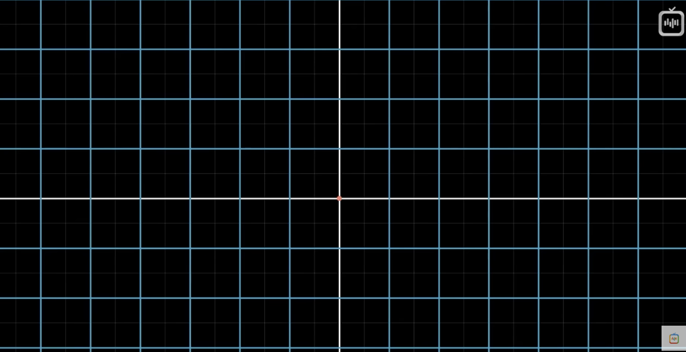

<blockquote>Цель вычислений — понимание, а не числа. Richard Hamming</blockquote>

<blockquote>Использование чисел в качестве координат — акт насилия. Hermann Weyl</blockquote>

<blockquote>Увы, невозможно объяснить, что такое матрица. Ты должен увидеть ее сам. Morpheus.</blockquote>

<blockquote>Задать правильный вопрос гораздо сложнее, чем на него ответить. Georg Cantor</blockquote>

## 1 Векторы

[ Конспект "Суть линейной алгебры: #1"](https://www.youtube.com/watch?v=cJslkj9_wyg)

<mark>Термины конспекта:</mark>

* _Вектор_
* _Координаты вектора_
* _Сложение векторов_
* _Умножение векторов_

___

<mark>Вектор</mark> — направленный отрезок. Обозначается парой чисел в квадратных скобках, расположенных вертикально. Точка же описывается парой чисел в круглых скобках, расположенных горизонтально.

```graph
bounds: [-5, 5, 5, -5]
keepAspectRatio: false
drag: false
showNavigation: false
height: 400
width: 500
elements: [
	{type: arrow, def: [[0, 0], [2, 2]]},
	{type: text, def: [0.4, 1.15, l]},
	{type: text, def: [0.4, 0.9, l]},
	{type: text, def: [0.8, 1.15, l]},
	{type: text, def: [0.8, 0.9, l]},
	{type: text, def: [0.55, 1.2, 2]},
	{type: text, def: [0.55, 0.9, 2]},

	{type: point, def: [3, 3]},
	{type: text, def: [3.5, 3.5, '(3, 3)']},
	]
```
$$
\vec{AB} = \begin{bmatrix}
2 \\
2
\end{bmatrix}
;
A = (3, 3)
$$

### Физика

* С точки зрения , векторы — стрелки, имеющие направление в пространстве. Характеристики, определяющие вектор: длина и направление. Если они неизменны, то вектор можно перемещать куда угодно и это будет тот же вектор.

```graph
bounds: [-5, 5, 5, -5]
keepAspectRatio: false
drag: false
showNavigation: false
height: 400
width: 500
elements: [
	{type: arrow, def: [[0, 0], [2, 2]]},
	{type: text, def: [2, 2, B]},
	{type: text, def: [0, 0, A]}
	]
```

### Информатика

* С точки зрения информатики, вектор — упорядоченный список чисел. Можно сказать, что _вектор_ — другой способ назвать упорядоченный список (sorted list).
$$
\vec{AB} = \begin{bmatrix}
0 \\
-3 \\
-5
\end{bmatrix}
$$

### Математика

* Математика обобщает обе точки зрения, утверждая, что векторами могут быть любые объекты, для которых заданы правила сложения их между собой и умножения вектора на число. В линейной алгебре вектор практически всегда вырастает из начала координат.

```graph
bounds: [-5, 5, 5, -5]
keepAspectRatio: false
drag: false
showNavigation: false
height: 400
width: 500
elements: [
	{type: arrow, def: [[0, 0], [1, 1.5]]},
	{type: arrow, def: [[1, 1.5], [3, 2]]},
	{type: arrow, def: [[0, 0], [3, 2]], att: {strokeColor: red}},
	{type: text, def: [3, 2, B]},
	{type: text, def: [0.1, -0.2, A]}
	]
```
$$
\begin{bmatrix}
1 \\
1.5
\end{bmatrix}
+
\begin{bmatrix}
2 \\
0.5
\end{bmatrix}
=
\begin{bmatrix}
1 + 2 \\
1.5 + 0.5
\end{bmatrix}
$$
___

```graph
bounds: [-5, 5, 5, -5]
keepAspectRatio: false
drag: false
showNavigation: false
height: 400
width: 500
elements: [
	{type: arrow, def: [[0, 0], [1, 1]]},
	{type: arrow, def: [[0, 0], [2, 2]], att: {strokeColor: red}},
	{type: text, def: [0.15, 0.6, 2x]},
	]
```
$$
2\begin{bmatrix}
1 \\
1
\end{bmatrix}
=
\begin{bmatrix}
2(1) \\
2(1)
\end{bmatrix}
=
\begin{bmatrix}
2 \\
2
\end{bmatrix}
$$
___

<mark>Координаты вектора</mark> — пара чисел, которые указывают, как добраться от хвоста (начала координат), до его конца.

#### Сложение векторов

В визуальном представлении, для того, чтобы сложить два вектора идущих от начала координат, необходимо перенести начало одного из векторов к концу другого

```graph
bounds: [-1, 3, 7, -1]
keepAspectRatio: false
drag: false
showNavigation: false
height: 400
width: 500
elements: [
	{type: arrow, def: [[0, 0], [1, 1.5]]},
	{type: arrow, def: [[0, 0], [2, 0.5]]},
	{type: text, def: [2.2, 1, =]},

	{type: arrow, def: [[2, 0], [3, 1.5]]},
	{type: arrow, def: [[3, 1.5], [5, 2]]},
	{type: arrow, def: [[2, 0], [5, 2]], att: {strokeColor: red}},
	]
```
$$
\begin{bmatrix}
1 \\
1.5
\end{bmatrix}
+
\begin{bmatrix}
2 \\
0.5
\end{bmatrix}
=
\begin{bmatrix}
3 \\
2
\end{bmatrix}
$$
___
#### Умножение векторов

При умножении вектора на число, графически мы изменяем его длину. Процесс умножения иначе называется <mark>масштабированием</mark>, а число, на которое умножается вектор — <mark>скаляр (scalar — scale)</mark>.

```graph
bounds: [-1, 5, 9, -1]
keepAspectRatio: false
drag: false
showNavigation: false
height: 400
width: 500
elements: [
	{type: arrow, def: [[0, 0], [3, 2]]},
	{type: text, def: [2.2, 1, 'x2 =']},

	{type: arrow, def: [[2, 0], [8, 4]], att: {strokeColor: red}},
	]
```
$$
2 \times \begin{bmatrix}
3 \\
2
\end{bmatrix}
=
\begin{bmatrix}
3 \times 2 \\
2 \times 2
\end{bmatrix}
=
\begin{bmatrix}
6 \\
4
\end{bmatrix}
$$
Каждое значение вектора можно представить как скаляр, каждое из которых растягивает или сжимает вектор
$$
\begin{bmatrix}
3 - скаляр \\
2 - скаляр
\end{bmatrix}
$$
___
## 2 Линейная комбинация, линейная оболочка и базисные векторы

[Конспект "Суть линейной алгебры: #2"](https://www.youtube.com/watch?v=W8tQU4YhkQo)

<mark>Термины конспекта:</mark>

* _Базис и базисные векторы_
* _Линейная комбинация_
* _Линейная оболочка_
* _Линейная зависимость (коллинеарность)_
* _Скаляр_

___

В системе координат XY есть два очень важных вектора (так же называются <mark>базис</mark> или <mark>базисные векторы</mark>): 
* i - направлен вправо и длиной в единицу (единичный вектор по оси X)
* j - направлен вверх и длиной в единицу (единичный вектор по оси Y)

Теперь представим, что координата X нашего вектора — это <mark>скаляр</mark>, который масштабирует вектор i <mark>(базис)</mark>, растягивая его в три раза, а координата Y — это скаляр, который масштабирует вектор j <mark>(базис)</mark> и переворачивает его. При таком подходе, вектор, который описывается двумя координатами, это сумма двух масшабированных векторов

```graph
bounds: [-3, 4, 4, -4]
keepAspectRatio: false
drag: false
showNavigation: false
height: 400
width: 500
elements: [
	{type: arrow, def: [[0, 0], [3, -2]], att: { strokeColor: 'red' }},
	{type: arrow, def: [[0, 0], [1, 0]]},
	{type: arrow, def: [[0, 0], [0, 1]]},
	{type: text, def: [0.4, 0.3, 'i']},
	{type: text, def: [-0.2, 0.5, 'j']},
	{type: text, def: [2, -2, '(3)i+(-2)j']},
	]
```
$$
\begin{bmatrix}
3 \\
-2
\end{bmatrix}
=
(3)i+(-2)j
$$

Любое численное описание векторов зависит от того, какие базисные векторы мы взяли. Любая операция, при которой мы масштабируем два вектора и складываем их, называется <mark>линейной комбинацией</mark> этих векторов. При этом изменяя значения скаляров этих векторов, мы можем "дотянуться" до любой точки на графике. Исключением будут два вектора, лежащих на одной прямой — тогда изменение скаляров будет только увеличивать длину результирующего вектора.

Множество векторов, которые получаются с помощью <mark>линейной комбинации</mark> заданной пары векторов, называется <mark>линейной оболочкой</mark> этих векторов.  _<mark>Линейная оболочка</mark> большинства пар двумерных векторов охватывает все пространство_

Из-за возможной визуальной загруженности, векторы часто изображают точками на графике, которые соответствуют концам этих векторов (при условии, что вектор растет из начала координат). _Если речь идет об одном векторе, то его лучше представить в виде прямой. Если же речь идет о множестве векторов, то удобнее представлять их в виде точек._

```graph
bounds: [-3, 4, 4, -4]
keepAspectRatio: false
drag: false
showNavigation: false
height: 400
width: 500
elements: [
	{type: point, def: [1, 1]},
	{type: point, def: [2, 1]},
	{type: point, def: [3, 2]},
	{type: point, def: [-1, 2]},
	
	]
```

В трехмерном пространстве, если два вектора лежат на одной линии, а третий вектор нет — <mark>линейная оболочка</mark> все равно охватит все пространство, так как третий вектор "протянет" плоскость двух первых векторов через все пространство.

С другой стороны, если третий вектор лежит в плоскости первых двух, то один из трех векторов <mark>избыточен</mark> и не добавляет ничего к нашей <mark>линейной оболочке</mark>. Если один из векторов можно убрать, не уменьшив линейную оболочку, то говорят, что векторы <mark>линейно зависимы (коллинеарны)</mark>. Другими словами, один из векторов можно выразить как комбинацию остальных, ведь он лежит в их линейной оболочке.

Если же новый вектор увеличивает размерность линейной оболочки, такие векторы называются <mark>линейно независимыми (неколлинеарны)</mark>.

```graph
bounds: [-10, 10, 10, -10]
bounds3d: [[-2,8], [-5,5], [-5,5]]
axis: false
keepAspectRatio: true
elements: [ 
	{type: line3d, def: [[0,0,0], [1,2,0]]},
	{type: line3d, def: [[0,0,0], [2,1,0]]},
	{type: line3d, def: [[0,0,0], [0,1,2]]},
	{type: plane3d, def: [[0, 0, 0], [1,2,0],[2, 1, 0]]},
	{type: plane3d, def: [[0, 0, 0], [1,2,0],[0, 1, 2]]},
	{type: plane3d, def: [[0, 0, 0], [2,1,0],[0, 1, 2]]},
]
```
<center>
На 3d графике можно видеть 3 плоскости, образованные парами векторов, которые можно протянуть через все пространство, изменяя скаляры векторов.
</center>

 <blockquote>Базис пространства — это набор неколлинеарных векторов, чья линейная оболочка формирует это пространство.</blockquote>

## 3 Линейные преобразования и матрицы

[Конспект "Суть линейной алгебры: #3"](https://www.youtube.com/watch?v=fXNPMs1ZgTI)

<mark>Термины конспекта:</mark>

* _Линейное преобразование (Linear transformation)_ 
* _Преобразование пространства_

___

<mark>Линейное преобразование</mark> — просто красивое название для <mark>функции</mark>. Функция преобразовывает линейные данные по неким правилам. Математики используют термин "Линейное преобразование" просто потому, что так чуть понятнее, что функция делает с данными. Можно так же сказать, что линейное преобразование векторов в новые — перемещение каждой точки пространства (точкой считать конец вектора) на новое место. 

В математике, в основном, использую такие преобразования, при которых сетка, образованная векторами, не изгибается (линии сетки остаются <mark>прямыми, параллельными и равноудаленными</mark>). В случае, если линии искривляются, такое преобразование не является линейным.

|              |  |  |
| ------------------------------------------------------- | ----------------------------------------------- | ------------------------------------------------------- |
| Без преобразования (Пересечения линий — концы векторов) | <mark>Линейное преобразование</mark>            | Нелинейное преобразование                               |

_Как выяснить формулу линейного преобразования, если векторов много?_ Достаточно вычислить, где окажутся два базисных вектора i и j, а остальные векторы можно вычислить через них.

Возьмем вектор `v = -1i + 2j`. Если мы используем какое-нибудь линейное преобразование, то тот факт, что линии сетки остаются параллельными и равноудаленными, будет иметь одно очень полезное следствие: вектор `v` останется все той же комбинацией базисных векторов, но уже преобразованных базисных векторов. Это значит, мы можем узнать куда попадет вектор `v`, зная, куда попали `i` и `j`.

```graph
bounds: [-3, 4, 6, -4]
keepAspectRatio: false
drag: false
showNavigation: false
height: 400
width: 500
elements: [
	{type: arrow, def: [[0, 0], [1, 0]], att: { color: violet }},
	{type: arrow, def: [[0, 0], [0, 1]], att: { color: violet }},
	{type: arrow, def: [[0, 0], [-1, 2]], att: { strokeColor: blue }},
	{ type: text, def: [0.5, -0.2, 'i'], att: { color: violet }},
	{ type: text, def: [0.2, 0.5, 'j'], att: { color: violet }},
	{ type: text, def: [-1.5, 1, 'вектор V'], att: { color: blue }},

	{type: arrow, def: [[0, 0], [1, -2]], att: { strokeColor: green }},
	{type: arrow, def: [[0, 0], [3, 0]], att: { strokeColor: green }},
	{type: arrow, def: [[0, 0], [5, 2]], att: { strokeColor: yellow }},
	{ type: text, def: [0.7, -1, 'i new'], att: { color: green }},
	{ type: text, def: [1.5, 0.2, 'j new'], att: { color: green }},
	{ type: text, def: [1.5, 1.2, 'вектор V new'], att: { color: yellow }},
	]
```

![[../assets/3blue1brown/linear-transform-example-1.png]]
<center>
На изображении видна изначальная сетка и сетка после линейного преобразования (косые линии). Ориентируясь по изначальной сетке, мы можем вычислить положение вектора V после преобразования базисных векторов i и j.
</center>
$$
\begin{array}
\vec{V} = -1i + 2j
\\
\text{Transformed v = -1(Transformed i) + 2(Transformed j)}
\\ 
\vec{Vnew} = -1\times \begin{bmatrix}
1 \\ -2
\end{bmatrix} +  
2 \times \begin{bmatrix}
3 \\ 0
\end{bmatrix} = \begin{bmatrix}
5 \\ 2
\end{bmatrix}
\end{array}
$$

Из всего этого мы можем понять, что положение любого вектора [x y] мы можем вычислить, зная преобразования базисных векторов (иначе говоря, новые координаты базисных векторов после преобразования). Таким образом мы можем преобразовать любой вектор.
$$
\begin{bmatrix}
x \\ y
\end{bmatrix}
\to
x \begin{bmatrix}
1 \\ -2
\end{bmatrix}
+
y\begin{bmatrix}
3 \\ 0
\end{bmatrix}
=
\begin{bmatrix}
1x + 3y \\ -2x + 0y
\end{bmatrix}
$$
<blockquote>Двумерное линейное преобразование можно описать всего четыремя числами: двумя координатами вектора i и двумя координатами вектора j, которое записывается матрицей 2x2. Каждая такая матрица — описание преобразования пространства (линейное преобразование)</blockquote>
$$
\begin{array}
-\begin{bmatrix}
3 & 2 \\
-2 & 1
\end{bmatrix} \\
\begin{bmatrix}
3 \\
-2
\end{bmatrix} 
\text{ — Координата i после преобразования} \\
\begin{bmatrix}
2 \\
1
\end{bmatrix} 
\text{ — Координата j после преобразования}
\end{array}
$$
![[../assets/vector/where-i-and-j-lands.png]]
<center>Матрица преобразование и удобное для запоминания представление ее столбцов (это представление очень полезно в перемножении матриц и композиции преобразования (следующая лекция под номером 4)</center>

Рассмотрим общий случай линейного преобразования вектора или другими словами <mark>умножения матрицы на вектор</mark>:
$$
\begin{bmatrix}
a & b \\
c & d
\end{bmatrix}
\begin{bmatrix}
x \\
y
\end{bmatrix} = 
x\begin{bmatrix}
a \\
c
\end{bmatrix}
+
y\begin{bmatrix}
b \\
d
\end{bmatrix}=
\begin{bmatrix}
ax +by \\
cx + dy
\end{bmatrix}
$$

<blockquote>Все последующие темы и в целом линейная алгебра станет понятнее, если смотреть на матрицы как на <mark>преобразования пространства</mark></blockquote>

## 4 Произведение матриц, или композиция преобразований

[Конспект "Суть линейной алгебры: #4"](https://www.youtube.com/watch?v=_I03qVUXyF4)

<mark>Термины конспекта:</mark>

* _Композиция преобразования (composition)_

___

### Подведение итогов предыдущих лекций:

Линейное преобразование — функция, которая берет один вектор и преобразовывает его в другой, что можно изобразить, как <mark>сжатие</mark> и <mark>растяжение</mark> пространства, при котором <mark>линии сетки остаются параллельными и равноудаленными</mark>, а <mark>начало координат не смещается</mark>.
$$
\begin{array}
\vec{v} = \begin{bmatrix}
5 \\
7
\end{bmatrix} \\
L(\vec{v}) = \begin{bmatrix}
2 \\
-3
\end{bmatrix}
\end{array}

$$
Для описания преобразования достаточно описать, куда переместятся базисные векторы i и j. Любой другой вектор можно описать как <mark>линейную комбинацию</mark> двух базисных векторов
$$
\begin{array}
\vec{v} = \begin{bmatrix}
x \times i\\
y \times j
\end{bmatrix} \\
\vec{vnew} = \begin{bmatrix}
x \times inew \\
y \times jnew
\end{bmatrix}
\end{array}
$$
Новые координаты (после преобразования) базисных векторов принято записывать в матрицы 2х2. Операцию сложения произведений этих столбцов на x и y называют <mark>умножением матрицы на вектор</mark>. Умножение матрицы на ветор — способ математически рассчитать, что произойдет с вектором после преобразования.
$$
\begin{bmatrix}
a & b \\
c & d
\end{bmatrix}
\begin{bmatrix}
x \\
y
\end{bmatrix} = 
x\begin{bmatrix}
a \\
c
\end{bmatrix}
+
y\begin{bmatrix}
b \\
d
\end{bmatrix}=
\begin{bmatrix}
ax +by \\
cx + dy
\end{bmatrix}
$$
### Описание эффекта двух преобразований

Например, мы можем повернуть плоскость на 90 градусов, а затем применить сдвиг. Совокупный эффект двух преобразований можно выразить как новое линейное преобразование, отличающееся от первых двух. Такое сочетание обычно называют <mark>композицией преобразований</mark> (что все еще является линейным преобразованием). Получившаяся матрица описывает совокупный эффект от поворота и сдвига, будто это <mark>одно действие, а не два последовательных</mark>.

![[../assets/3blue1brown/4-1.png]]
<center>На изображении представлена композиция преобразования, где сначала базисные векторы были повернуты на 90 градусов, а затем был произведен сдвиг вектора i на единицу вправо</center>

Если к вектору нужно последовательно применить два преобразования, можно пойти долгим путем и сначала умножить вектор на матрицу поворота, а затем — на матрицу сдвига
$$
\begin{bmatrix}
1 & 1 \\
0 & 1
\end{bmatrix}
\begin{pmatrix}


\begin{bmatrix}
0 & -1 \\
1 & 0
\end{bmatrix}
\begin{bmatrix}
x \\
y
\end{bmatrix}
\end{pmatrix}
$$
Однако быстрее умножить вектор на матрицу, задающую композицию этих преобразований. Такой подход применим к любому вектору. Новая матрица описывает то же самое, что и комбинация двух предыдущих. Новую матрицу можно назвать <mark>произведением</mark> или <mark>композицией</mark> двух матриц
$$
\begin{bmatrix}
1 & 1 \\
0 & 1
\end{bmatrix}
\begin{pmatrix}


\begin{bmatrix}
0 & -1 \\
1 & 0
\end{bmatrix}
\begin{bmatrix}
x \\
y
\end{bmatrix}
\end{pmatrix}
=
\begin{bmatrix}
1 & -1 \\
1 & 0
\end{bmatrix}
\begin{bmatrix}
x \\
y
\end{bmatrix}
$$
$$
\begin{bmatrix}
1 & 1 \\
0 & 1
\end{bmatrix}
\begin{bmatrix}
0 & -1 \\
1 & 0
\end{bmatrix}
=
\begin{bmatrix}
1 & -1 \\
1 & 0
\end{bmatrix}
$$
С точки зрения геометрии, перемножение двух матриц — поочередное применение соответствующих преобразований.

<mark>Такие записи перемножения (композиции) читаются справа налево</mark> (сначала выполняется преобразование, представленное правой матрицей, а затем — левой). Это проистекает из того, как мы записываем функции преобразования

![[../assets/3blue1brown/4-2.png]]

Еще один пример преобразования:

Вычисляем, куда попадет базисный вектор i. <mark>Когда мы применяем матрицу M1, то новые координаты i задаются первым столбцом матрицы [1 1]</mark>. 
 $$
M_{2} = 
 \begin{bmatrix}
0 & 2 \\
1 & 0
\end{bmatrix};
M_{1} = 
\begin{bmatrix}
1 & -2 \\
1 & 0
\end{bmatrix}
$$
<center>Матрицы преобразования  M1 (поворот) и M2 (сдвиг) </center>
___
$$
\begin{bmatrix}
0 & 2 \\
1 & 0
\end{bmatrix}
\begin{bmatrix}
1 & -2 \\
1 & 0
\end{bmatrix}
=
\begin{bmatrix}
? & ? \\
? & ?
\end{bmatrix}
$$
<center>Композиция преобразований M1 и M2 для расчета</center>
___
$$

\begin{bmatrix}
0 & -1 \\
1 & 0
\end{bmatrix}
\begin{bmatrix}
1 & 0 \\
0 & 1
\end{bmatrix}
=
\begin{bmatrix}
? & ? \\
? & ?
\end{bmatrix}
$$
<center>Вычисляем результат преобразования первой матрицы</center>
___
$$
i = 1\begin{bmatrix}
0 \\
1
\end{bmatrix}
+
0\begin{bmatrix}
-1 \\
0
\end{bmatrix}
=
\begin{bmatrix}
0 \\
1
\end{bmatrix}
$$
<center>Вектор i после преобразования M1</center>
___
$$
j = 0\begin{bmatrix}
0 \\
1
\end{bmatrix}
+
1\begin{bmatrix}
-1 \\
0
\end{bmatrix}
=
\begin{bmatrix}
-1 \\
0
\end{bmatrix}
$$
<center>Вектор j после преобразования M1</center>
___
$$

\begin{bmatrix}
0 & -1 \\
1 & 0
\end{bmatrix}
\begin{bmatrix}
1 & 0 \\
0 & 1
\end{bmatrix}
=
\begin{bmatrix}
0 & -1 \\
1 & 0
\end{bmatrix}
$$
<center> Результат преобразования M1. Доказательство утверждения, что базисные векторы просто принимают координаты первой матрицы преобразования</center>
___

Чтобы узнать, что произойдет после второго преобразования, умножаем матрицу M2 на вектор [1 1], который мы только что получили.
$$
i =
\begin{bmatrix}
0 & 2 \\
1 & 0
\end{bmatrix}
\begin{bmatrix}
1 \\
1
\end{bmatrix}
=
1\begin{bmatrix}
0 \\
1
\end{bmatrix} +
1\begin{bmatrix}
2 \\
0
\end{bmatrix}
= 
\begin{bmatrix}
2 \\
1
\end{bmatrix}
$$
<center>Вычисление положения базисного вектора i</center>
___
$$
j =
\begin{bmatrix}
0 & 2 \\
1 & 0
\end{bmatrix}
\begin{bmatrix}
-2 \\
0
\end{bmatrix}
=
-2\begin{bmatrix}
0 \\
1
\end{bmatrix} +
0\begin{bmatrix}
2 \\
0
\end{bmatrix}
= 
\begin{bmatrix}
0 \\
-2
\end{bmatrix}
$$
<center>Вычисление положения базисного вектора j</center>
___
![[../assets/vector/4-3.png]]

Выполним те же преобразования, но теперь с буквами и представим <mark>формулу преобразования</mark>:
$$
\begin{bmatrix}
a & b \\
c  & d
\end{bmatrix}
\begin{bmatrix}
e & f \\
g & h
\end{bmatrix}
= 
\begin{bmatrix}
ae + bg  & af + cf \\
ce + dg & bh + dh
\end{bmatrix}
$$
<center>Формула преобразования</center>
___
$$
\begin{bmatrix}
a & b \\
c & d
\end{bmatrix}
\begin{bmatrix}
e \\
g
\end{bmatrix}
=
e
\begin{bmatrix}
a \\
c
\end{bmatrix}
+
g\begin{bmatrix}
b \\
d
\end{bmatrix}
=
\begin{bmatrix}
ae + bg \\
ce + dg
\end{bmatrix}
$$
<center>Вектор i</center>
___
$$
\begin{bmatrix}
a & b \\
c & d
\end{bmatrix}
\begin{bmatrix}
f \\
h
\end{bmatrix}
=
f\begin{bmatrix}
a \\
c
\end{bmatrix}
+
h\begin{bmatrix}
b \\
d
\end{bmatrix}
=
\begin{bmatrix}
af+bh \\
cf + dh
\end{bmatrix}
$$
<center>Вектор j</center>
___

![[../assets/3blue1brown/4-4.png]]
<center>Формула преобразования двух матриц (композиция преобразования)</center>

<blockquote>Формулу преобразования нужно просто заучить. Это будет проще сделать, если представлять умножение матриц как последовательное применение линейных преобразований, как мы сделали ранее</blockquote>

![[../assets/3blue1brown/where-i-and-j-lands.png]]
<center>Напоминание того, как удобно представлять матрицу преобразования</center>
___

<blockquote><mark>Порядок преобразования</mark> (M1xM2 или M2xM1) <mark>важен</mark>. Результат (конечное положение базисных векторов) будет отличаться, если мы сначала применим сдвиг, а затем поворот. </blockquote>

$$
\begin{bmatrix}
1 & 1 \\
0 & 1
\end{bmatrix}
\begin{bmatrix}
0 & -1 \\
1 & 0
\end{bmatrix}
=
\begin{bmatrix}
? & ? \\
? & ?
\end{bmatrix}
$$
$$
i = 0\begin{bmatrix}
1 \\
0
\end{bmatrix}
+
1\begin{bmatrix}
1 \\
1
\end{bmatrix}
=
\begin{bmatrix}
1 \\
1
\end{bmatrix}
$$
$$
j = -1\begin{bmatrix}
1 \\
0
\end{bmatrix}
+
0\begin{bmatrix}
1 \\
1
\end{bmatrix}
=
\begin{bmatrix}
-1 \\
0
\end{bmatrix}
$$
$$
\begin{bmatrix}
1 & 1 \\
0 & 1
\end{bmatrix}
\begin{bmatrix}
0 & -1 \\
1 & 0
\end{bmatrix}
=
\begin{bmatrix}
1  & -1 \\
1 & 0
\end{bmatrix}
$$
<center>Наше первое преобразование. Сначала поворот, затем сдвиг </center>
___
$$
\begin{bmatrix}
0 & -1 \\
1 & 0
\end{bmatrix}
\begin{bmatrix}
1 & 1 \\
0 & 1
\end{bmatrix}
=
\begin{bmatrix}
? & ? \\
? & ?
\end{bmatrix}
$$
$$
i = 1\begin{bmatrix}
0 \\
1
\end{bmatrix}
+
0\begin{bmatrix}
-1 \\
0
\end{bmatrix}
= \begin{bmatrix}
0 \\
1
\end{bmatrix}
$$
$$
j = 1\begin{bmatrix}
0 \\
1
\end{bmatrix}
+
1\begin{bmatrix}
-1 \\
0
\end{bmatrix}
= \begin{bmatrix}
-1 \\
1
\end{bmatrix}
$$
$$
\begin{bmatrix}
0 & -1 \\
1 & 0
\end{bmatrix}
\begin{bmatrix}
1 & 1 \\
0 & 1
\end{bmatrix}
=
\begin{bmatrix}
0 & -1 \\
1 & 1
\end{bmatrix}
$$
<center>Обратное преобразование. Сначала сдвиг, затем поворот </center>
___

| ![[../assets/3blue1brown/4-5.png]]                        | ![[../assets/3blue1brown/4-6.png]]                        |
| --------------------------------------------------------- | --------------------------------------------------------- |
| _Результат преобразования после поворота, а затем сдвига_ | _Результат преобразования после сдвига, а затем поворота_ |

Перемножение матриц <mark>ассоциативно</mark>. (AB)C = A(BC). Другими словами, неважно, как мы расставим скобки в равенстве. В любом случае, сначала идет преобразование C, затем B, а затем — A.

## 5 Линейные преобразования в 3D

[Конспект "Суть линейной алгебры: #5"](https://www.youtube.com/watch?v=J3XG-hzX2aA)

 Рассмотрим преобразование, где одни трехмерные векторы преобразуются в другие трехмерные векторы. Визуализировать его можно, представив перемещение всех точек трехмерного пространства, при котором линии остаются параллельными и равноудаленными, а начало координат никуда не смещается. Так же, как и в случае с двумя измерениями, преобразование можно описать, поняв, куда перемещаются базисные векторы  <mark>i, j и k</mark> 
 
 ![[../assets/3blue1brown/5-1.png]]
<center>Положение базисных векторов после матрицы поворота</center>
$$
\begin{bmatrix}
0 & 0 & 1 \\
0 & 1 & 0 \\
-1 & 0 & 0
\end{bmatrix}
$$<center>Простое преобразование трехмерного пространства, которое описывает поворот пространства на 90 градусов по оси </center>

Построение трехмерного вектора происходит по тем же принципам, что и построение двумерного: каждая координата дает инструкцию по масштабированию базисного вектора, а их сумма даст искомый вектор

![[../assets/3blue1brown/5-2.png]]
<center>Вычисление вектора v через базисные векторы</center>

Чтобы понять, куда переместится вектор, нужно умножить его координаты на соответствующие столбцы матрицы преобразования, а затем просто сложить результат

![[../assets/3blue1brown/5-3.png]]
<center>Умножение матрицы на трехмерный вектор</center>

Умножение матриц тоже особо не отличается от двумерного. <mark>Умножение трехмерных матриц играет важную роль в компьютерной графике и робототехнике</mark>
$$
\begin{bmatrix}
0 & -2 & 2 \\
5 & 1 & 5 \\
1 & 4 & -1
\end{bmatrix}
\begin{bmatrix}
0 & 1 & 2 \\
3 & 4 & 5 \\
6 & 7 & 8
\end{bmatrix}
=
\begin{bmatrix}
? & ? & ? \\
? & ? & ? \\
? & ? & ?
\end{bmatrix}
$$
$$
i = 
0\begin{bmatrix}
0 \\
5 \\
1
\end{bmatrix}
+
3\begin{bmatrix}
-2 \\
1 \\
4
\end{bmatrix}
+
6\begin{bmatrix}
2 \\
5 \\
-1
\end{bmatrix}
=
\begin{bmatrix}
6 \\
33 \\
6
\end{bmatrix}
$$
$$
j = 
1\begin{bmatrix}
0 \\
5 \\
1
\end{bmatrix}
+
4\begin{bmatrix}
-2 \\
1 \\
4
\end{bmatrix}
+
7\begin{bmatrix}
2 \\
5 \\
-1
\end{bmatrix}
=
\begin{bmatrix}
6 \\
44 \\
10
\end{bmatrix}

$$
$$
k = 
2\begin{bmatrix}
0 \\
5 \\
1
\end{bmatrix}
+
5\begin{bmatrix}
-2 \\
1 \\
4
\end{bmatrix}
+
8\begin{bmatrix}
2 \\
5 \\
-1
\end{bmatrix}
=
\begin{bmatrix}
6 \\
55 \\
14
\end{bmatrix}
$$
$$
\begin{bmatrix}
0 & -2 & 2 \\
5 & 1 & 5 \\
1 & 4 & -1
\end{bmatrix}
\begin{bmatrix}
0 & 1 & 2 \\
3 & 4 & 5 \\
6 & 7 & 8
\end{bmatrix}
=
\begin{bmatrix}
6 & 6 & 6 \\
33 & 44 & 55 \\
6 & 10 & 14
\end{bmatrix}
$$
<center>Перемножение трехмерных матриц</center>

$$
\begin{bmatrix}
a & b & c \\
d  & f & g \\
h & i & j
\end{bmatrix}
\begin{bmatrix}
1 & 2 & 3 \\
4  & 5 & 6 \\
7 & 8 & 9
\end{bmatrix}
=
\begin{bmatrix}
1a+4b+7c & 2a+5b+8c & 3a+6b+9c \\
1d+4f+7g & 2d+5f+8g & 3d+6f+9g \\
1h+4i+7j & 2h+5i+8j & 3h+6i+9j
\end{bmatrix}
$$
<center>Формула перемножения трехмерных матриц</center>

## 6 Определитель или детерминант

[Конспект "Суть линейной алгебры: #6"](https://www.youtube.com/watch?v=GTTIVtxQAXg)

<mark>Термины конспекта:</mark>

* Определитель (determinant)
* Отрицательный определитель
* Ориентация пространства
* Вычисление определителя

___

Линейные преобразования трансформирую пространство. Одни его растягивают, другие, наоборот, — сжимают. И кое-что интересное о самом преобразовании можно узнать по тому, насколько сильно растягивается или сжимается пространство. Для этого нужно измерить насколько сильно изменяется площадь некоторой области.

![[../assets/3blue1brown/6-1.png]]
<center>Измененная площадь области</center>

Например, возьмем матрицу Y: она растягивает вектор i в 3 раза, и растягивает вектор j в 2 раза.

```graph
bounds: [-3, 4, 4, -4]
keepAspectRatio: false
drag: false
showNavigation: false
height: 400
width: 500
elements: [
	{type: arrow, def: [[0,0], [3,0]], att: {strokeColor: yellow}},
	{type: arrow, def: [[0,0], [0,2]], att: {strokeColor: yellow}},
	{type: polygon, def: [[0,0], [1,0], [1, 1],[0, 1]], att: {vertices: {strokeColor: red}, borders: {strokeColor: red}}},
	{type: polygon, def: [[0,0], [3,0], [3, 2],[0, 2]], att: { vertices: {strokeColor: yellow}, borders: {strokeColor: red}}},
	]
```
$$
Y = \begin{bmatrix}
3 & 0 \\
0 & 2
\end{bmatrix}
$$
После преобразования, прямоугольник площадью 1х1 превращается в прямоугольник площадью 3x2. Поскольку площадь выбранной области была равна 1, а стала равна 6, можно сказать, что линейное преобразование увеличило его площадь в 6 раз.

Сравним предыдущее линейное преобразование с преобразованием с помощью матрицы сдвига. Его площадь остается прежней, потому что его высота и основание остались прежними.

```graph
bounds: [-3, 4, 4, -4]
keepAspectRatio: false
drag: false
showNavigation: false
height: 400
width: 500
elements: [
	{type: arrow, def: [[0,0], [1,0]], att: {strokeColor: yellow}},
	{type: arrow, def: [[0,0], [1,1]], att: {strokeColor: yellow}},
	{type: polygon, def: [[0,0], [1,0], [1, 1],[0, 1]], att: {vertices: {strokeColor: red}, borders: {strokeColor: red}}},
	{type: polygon, def: [[0,0], [1,0], [2, 1],[1, 1]], att: {fill: {fillColor: yellow},vertices: {strokeColor: yellow, fillColor: yellow}, borders: {strokeColor: red}}},
	]
```
$$
Y = \begin{bmatrix}
1 & 1 \\
0 & 1
\end{bmatrix}
$$
<blockquote>Так как линии сетки остаются параллельными и равноудаленными после преобразования, <mark>любые изменения, происходящие с площадью единичного квадрата, будут происходить с любой другой площадью этого же пространства.</mark></blockquote>

___

<mark>Определитель (determinant) преобразования</mark> — коэффициент, на который изменяется площадь любой области при линейном преобразовании

![[../assets/3blue1brown/6-4.png]]
___
![[../assets/3blue1brown/6-3.png|center|500]]
<center>Площадь любой геометрической формы можно измерить с помощью квадратов. Чем квадраты меньше, тем точнее будет результат измерения.</center>

Важно заметить, что определитель допускает отрицательные значения. В этом случае, пространство просто разворачивается (изменение <mark>ориентации пространства</mark>). Принято говорить, что такие преобразования <mark>инвертируют ориентацию пространства</mark>. Соответственно, инверсия ориентации говорит о том, что у преобразования  <mark>отрицательный определитель</mark>. Модуль определителя (число без знака), все так же сообщает, на сколько изменится площадь (определитель равный "-3" говорит о том, что площадь увеличилась в три раза, а пространство — перевернуто).

![[../assets/3blue1brown/6-5.png]]
<center>Еще можно посмотреть на положение базисных векторов. Если вектор j после преобразования оказывается справа от вектора i, то ориентация пространства считается инвертированной</center>

<blockquote>В трехмерном пространстве определитель показывает, насколько увеличивается <mark>объем</mark>, а не <mark>площадь</mark>. Если определитель равен нулю, то это говорит о том, что трехмерное пространство превращается в плоскость, а двумерное — в линию (<mark>базисные векторы линейно зависимы или коллинеарны</mark>)</blockquote>


### Вычисление определителя

![[../assets/3blue1brown/6-6.png| center |500]]
<center>Формула вычисления определителя</center>

![[../assets/3blue1brown/6-7.png]]
![[../assets/3blue1brown/6-8.png]]
<center>Частично можно понять формулу, если использовать матрицу сдвига или матрицу, где базисные векторы увеличиваются только в длину</center>

<blockquote>Грубо говоря, если <mark>b</mark> и <mark>c</mark> не равны нулю, то произведение <mark>b*c</mark> показывает, насколько параллелограмм растягивается или сжимается по диагонали
</blockquote>

![[../assets/3blue1brown/6-9.png]]<center>Подробная иллюстрация вычисления определителя. Так же можно посмотреть <a href="https://habr.com/ru/articles/879410/">статью</a> по этой теме</center>
___
![[../assets/3blue1brown/6-10.png]]<center>Вычисление определителя для трехмерного пространства</center>

<blockquote>Важно так же понимать, что <mark>определитель результата двух перемноженных матриц равен произведению определителей исходных матриц</mark>. Другими словами, произведение матриц означает последовательное применение линейных преобразований, а определитель — во сколько раз преобразования растягивают или сжимают пространство. Тогда это равенство становится очевидным — первое преобразование расширяет пространство в <mark>N</mark> раз, а второе в <mark>M</mark>. Тогда их последовательное применение расширит пространство в <mark>N*M</mark> раз</blockquote>

$$
\det(M_{1}M_{2}) = \det(M_{1})\times\det(M_{2})
$$


## 7 Обратные матрицы, пространство столбцов, ранг и нуль-пространство

[Конспект "Суть линейной алгебры: #7"](https://www.youtube.com/watch?v=PUgQQtd9AL8)

<mark>Термины конспекта:</mark>

* Обратная матрицы
* Тождественное преобразование
* Нулевой определитель
* Ранг (rank)
* Пространство столбцов (Column space of A)
* Матрица полного ранга
* Нуль-пространство (Null space) или ядро матрицы (Kernel)

___

_Дополнительно необходимо разобрать темы, которые не освещаются в данном курсе:_
* Метод Гаусса.
* Приведение матрицы к ступенчатому виду.

<mark>Зачем нужна линейная алгебра?</mark> Помимо того, что она описывает преобразования пространства (используется в компьютерной графике и робототехнике), линейная алгебра универсальна и используется почти в любой технической области. И все потому, что она позволяет решать некоторые системы уравнений. <mark>Система уравнений</mark> — это равенства, в которых присутствуют одни и те же переменные — величины, которые нужно найти

![[../assets/3blue1brown/7-1.png|center|700]]
<center>Система уравнений. X, Y и Z — переменные, а число перед переменными — коэффициенты</center>
___

$$

\begin{align} 
2x+5y+3z&=-3  \\
4x+0y+8z&=0   \\
1x+3y+0z&= 2 
\end{align}

\qquad  \to \qquad  

\begin{bmatrix}
2 & 5 & 3 \\
4 & 0 & 8 \\
1 & 3 & 0
\end{bmatrix} 
\begin{bmatrix}
x \\
y \\
z
\end{bmatrix}
=
\begin{bmatrix}
-3 \\
0 \\
2
\end{bmatrix}


$$
<center>Систему уравнений можно представить в виде матрицы (или как обычное векторное уравнение): все коэффициенты окажутся в матрице, переменные станут координатами первого вектора, а равенство — координатами произведения матрицы на вектор</center>

![[../assets/3blue1brown/7-2.png]]
<center>Обозначим матрицу коэффициентов как <mark>A</mark>, вектор переменных как <mark>x</mark>, а вектор констант — <mark>v</mark>. </center>

Эти обозначения позволяют не просто записать всю систему уравнений в одну строку — такой подход позволяет подойти к решению геометрически.

Матрица <mark>A</mark> соответствует некоторому линейному преобразованию. Поэтому, чтобы решить уравнение <mark>Ax = v</mark>, надо найти такой вектор, который после преобразования попадает точно на <mark>v</mark>.
![[../assets/3blue1brown/7-3.png|center|600]]<center>Иллюстрация геометрического решения системы уравнений</center>

_То есть, сложную систему уравнений с несколькими переменными можно представить в уже знакомое преобразование пространства, в котором один вектор преобразуется в другой._

Рассмотрим пример с системой из двух уравнений с двумя неизвестными:

![[../assets/3blue1brown/7-4.png|center|600]]

Наши дальнейшие действия будут зависеть от того, сжимается ли пространство после преобразования (например, в прямую или точку), или же остается в тех же двух измерениях (говоря корректно, будет ли <mark>определитель</mark> равен нулю или нет).

#### Случай, где определитель НЕ равен нулю

Начнем со случая, когда определитель не равен нулю. В этом случае существует один и только один вектор <mark>x</mark>, из которого получается вектор <mark>v</mark>. И его можно найти, если как будто обратить преобразование вспять. Отследив этот процесс, мы найдем вектор <mark>x</mark>. Таким образом, мы получаем  <mark>обратное преобразование</mark>.

$$
\begin{align}
A^{-1}=
\begin{bmatrix}
0 & 1 \\
-1 & 0
\end{bmatrix} \\
A= 
\begin{bmatrix}
0 & -1 \\
1 & 0
\end{bmatrix}
\end{align}
$$
<center>Обратные матрицы обозначаем со степенью -1. В примере представлена матрица A, которая совершает поворот на 90 градусов. Обратная матрица возвращает все к исходному положению</center>

Суть обратного преобразования в том, что если сначала применить <mark>A</mark>, а потом <mark>A^-1</mark>,  то все вернется на свои места. Применение одного преобразования за другим — это, с точки зрения, алгебры — умножение матриц. Умножив обе матрицы, мы получим матрицу, которая ничего не меняет — это преобразование называют <mark>тождественным преобразованием</mark> и при нем базисные векторы остаются на местах (<mark>i = (1 0)</mark>,  <mark>j = (0 1)</mark>)

Если найти обратную матрицу (что обычно делает компьютер), то можно решить уравнение, просто умножив ее на вектор <mark>v</mark>. С геометрической точки зрения, это означает, что мы прокручиваем преобразование <mark>A</mark> назад и следим за вектором <mark>v</mark>.

<blockquote>Если подытожить, то мы переводим систему уравнений в произведение матрицы на вектор, где с помощью вектора <mark>v</mark> нам нужно найти вектор <mark>x</mark>, который преобразовывается в вектор <mark>v</mark>. Чтобы найти вектор <mark>x</mark>, нам необходимо умножить обратную матрицу на вектор <mark>v</mark>.
</blockquote>

<blockquote>
Если пространство после преобразования не сжимается в меньшую размерность (то есть его определитель не равен нулю (<mark>d(A) != 0</mark>)), то мы знаем, что существует обратное преобразование <mark>A^-1</mark>
</blockquote>

<blockquote>
Если перемножить матрицу преобразования и обратную матрицу, то получится так, будто мы ничего и не делали.
</blockquote>

<blockquote>
Если перемножить матрицу преобразования и обратную матрицу, то получится так, будто мы ничего и не делали.
</blockquote>

#### Случай, где определитель РАВЕН нулю

Если определитель равен нулю (пространство теряет одно из своих измерений), то можно сказать, что <mark>обратной матрицы нет</mark>, потому что невозможно растянуть прямую обратно в плоскость (по-крайней мере с помощью функции этого не сделать). Для этого пришлось бы преобразовать вектор во множество векторов, когда как функция выдает только один результат. Так что в случае с системой с тремя уравнениями, обратной матрицы не будет, если преобразование превращает пространство в плоскость, линию или точку. Все эти варианты — следствие нулевого определителя, потому что из-за него возникают области с нулевым объемом. Интересно то, что даже <mark>если у уравнения нет обратной матрицы, уравнение все еще может иметь решение</mark>: например, если преобразование сжимает пространство в прямую, но только если вектор <mark>v</mark> лежит на этой прямой

![[../assets/3blue1brown/7-5.png|center|600]]
<center>Пример уравнения с нулевым определителем и возможным решением.</center>

Если после преобразования пространство сжимается в прямую, решение найти сложнее, чем если оно сжимается в плоскость, хотя в обоих случаях определитель равен нулю. Этот нюанс, связанный с нулевым определителем, описывают понятием <mark>ранг</mark>:
* Когда в результате преобразования пространства получается <mark>прямая</mark> (то есть пространство одним измерением), то говорят, что у этого преобразования <mark>ранг 1</mark>
* Когда в результате преобразования пространства получается <mark>плоскость</mark> (пространство с двумя измерениями), то говорят, что у преобразования <mark>ранг 2</mark>

Проще говоря, <mark>ранг — это количество измерений, оставшихся после преобразования</mark>. Для пространства с тремя измерениями, максимальный ранг равен 3. Для пространства с двумя измерениями, максимальный ранг равен 2.

Пространство, состоящее из всех возможных результатов, которые может выдать матрица (максимальный ранг для преобразования), называют <mark>пространством столбцов</mark>. Что логично, потому что столбцы матрицы показывают, куда переходят базисные векторы, и <mark>линейная оболочка</mark> (Множество векторов, которые получаются с помощью <mark>линейной комбинации</mark>) этих преобразованных базисных векторов, дает все возможные результаты. Так что по определению, <mark>пространством столбцов — это линейная оболочка столбцов матрицы</mark>.

Если говорить более строго, то <mark>ранг — это количество измерений пространства стобцов</mark>. Матрицу с максимальным рангом (то есть ту, у которой ранг соответствует количеству столбцов), называют <mark>матрицей полного ранга</mark>.

Нулевой вектор (0 0) всегда включен в пространство столбцов, поскольку при линейных преобразованиях начало координат всегда остается на своем месте. Но если матрица сжимает пространство в меньшую размерность, то нулевым может стать целый набор векторов. Например, если после преобразования плоскость сжимается в прямую, это значит что еще одна прямая, перпендикулярная оставшейся и все лежащие на ней векторы стали нулевыми. Если трехмерное пространство становится плоскостью, это, опять же, значит, что векторы одной из прямых оказались в точке ноль. Множество векторов, которые становятся нулевыми после преобразования, называют <mark>нуль-пространством (Null space) или ядром (Kernel) матрицы</mark>. Это векторное пространство, содержащее все векторы, находящиеся в начале координат. Когда мы рассматриваем систему линейных уравнений, где вектор <mark>v</mark> имеет координаты (0 0), то нуль-пространство содержит все возможные решения этой системы

![[../assets/3blue1brown/7-6.png|center|600]]
<center>Уравнение, где вектор v имеет координаты (0 0), нуль-пространство содержит все возможные решения этой системы</center>

<blockquote>
В этом конспекте показано, как можно геометрически представить систему уравнений. Если для матрицы преобразования существует обратная матрица (обычно считается компьютером), то с ее помощью можно найти решение системы уравнений. Если же обратного преобразования нет, то пространство столбцов подскажет, есть ли у системы решение, а нуль-пространство покажет, как множество этих решений может выглядеть.
</blockquote>

## 8 Неквадратные матрицы

[Конспект "Суть линейной алгебры: #8"](https://www.youtube.com/watch?v=K0w3-65ZbeQ)

Преобразования между разными размерностями вполне допустимы. Мы можем сделать трехмерный вектор из двумерного, сохраняя прежние требования линейных трансформаций: сетки останутся параллельными и равноудаленными, а центр координат никуда не сдвинется. Но стоит понимать, что двумерные и трехмерные векторы — это принципиально разные объекты, существующие в отдельных, никак не связанных друг с другом пространствах.

![[../assets/3blue1brown/8-1.png]]
<center>Слева — обычная двумерная плоскость. Справа — результат преобразования в трехмерном пространстве.</center>
___

![[../assets/3blue1brown/8-2.png]]<center>Матричная запись таких преобразований работает так же, как и в предыдущих случаях. Вектор i приземлятся в координатах (2 -1 -2), а вектор j в координатах (0 1 1). То, куда в принципе могут попасть векторы после преобразования — это двумерная плоскость, проходящая через начало координат трехмерного пространства. Но это все равно матрица полного ранга, ведь у пространства столбцов размерность та же, что и размеры исходного пространства.</center>

Если задачи с преобразованием размерности пространства встречаются, то нужно знать, что геометрически она преобразует два измерения в три. Стобцов два, а это значит, что в пространстве два базисных вектора.


| ![[../assets/3blue1brown/8-3.png]] | ![[../assets/3blue1brown/8-4.png]] |
| ---------------------------------- | ---------------------------------- |
<center>То же самое и с тремя векторами. Преобразование превращает трехмерное пространство в плоскость, поскольку у базисных векторов всего по две координаты, которые лежат в плоскости xy</center>


## 9 Скалярное произведение

[Конспект "Суть линейной алгебры: #9"](https://www.youtube.com/watch?v=FpYyabnk0-E)

<mark>Термины конспекта:</mark>

* Двойственность
* Перевод вектора в число

___

_Классическое определение скалярного произведения:_

Возьмем два вектора одинаковой размерности (то есть два списка чисел одинаковой длины).  Чтобы получить их скалярное произведение, нужно перемножить их пары координат и сложить результаты.
$$
\begin{bmatrix}
2 \\
7 \\
1
\end{bmatrix}
\times
\begin{bmatrix}
8 \\
2 \\
8
\end{bmatrix}
=
2\times 8 + 7\times 2 + 1\times 8 =
38
$$
<center>Пример скалярного произведения</center>

Скалярное произведение можно наглядно показать геометрически:
Чтобы скалярно перемножить векторы v и w, нужно спроецировать w на направление вектора v. Умножив длину этой проекции на длину вектора v, мы получим скалярное произведение векторов.

![[../assets/3blue1brown/9-1.png]]
$$
\begin{align}
\begin{bmatrix}
a \\
b
\end{bmatrix}
\times
\begin{bmatrix}
c \\
d
\end{bmatrix} 
= 
\text{Длина }\vec{v} \times \text{Длина спроецированного }\vec{w}
\end{align}

$$
___

![[../assets/3blue1brown/9-2.png]]
<center>Если проекция w будет лежать в противоположную сторону от вектора v, то результат скалярного произведения будет отрицательным.</center>

___

![[../assets/3blue1brown/9-3.png]]
<center>Если векторы перпендикулярны, то проекция дает нам нулевую длину. Тогда и скалярное произведение будет равно нулю.</center>

___

![[../assets/3blue1brown/9-4.png]]
<center>Все рассуждения справедливы и при проекции v на w. Алгоритм и результат остаются теми же.</center>

_Но возникает вопрос: при чем же здесь все эти проекции, если при скалярном произведении мы просто перемножаем и складываем числа списков?_

Для этого стоит поговорить о математической концепции, которую называют <mark>двойственность</mark>. Двойственность в математике — это фундаментальный принцип, который гласит, что для любого верного утверждения можно получить новое верное утверждение, заменив в исходном утверждении все понятия на их двойственные аналоги. Например, точка и прямая являются двойственными понятиями. Утверждение о том, что через две точки проходит единственная прямая, двойственно утверждению, что две прямые пересекаются в единственной точке, и наоборот.

Рассмотрим преобразование из двумерного пространства в одномерное (плоскость в числовую прямую или <mark>перевод вектора в число</mark>):

| ![[../assets/3blue1brown/9-5.png\|300]] | ![[../assets/3blue1brown/9-6.png\|300]] | ![[../assets/3blue1brown/9-7.png\|300]] |
| --------------------------------------- | --------------------------------------- | --------------------------------------- |

Представим вектор v (4 3). Для того, чтобы рассчитать то, куда попадет вектор v после преобразования, нужно умножить 4 на то, куда попал вектор i и умножить 3 на то, куда попал вектор j, а затем сложить результаты. В примере ниже мы получаем -2 (сложив конец вектора i с началом вектора j):

![[../assets/3blue1brown/9-8.png]]

Если все это записать числами, то у нас получится обычное умножение матрицы на вектор:
$$
\begin{bmatrix}
1 & -2
\end{bmatrix}
\begin{bmatrix}
4 \\
3
\end{bmatrix}=
4\times 1 + 3 \times -2 = -2
$$
<center>Скалярное произведение двух векторов</center>

Стоит заметить, что любая матрица 1х2, это, в каком-то смысле, двумерный вектор:
$$
\begin{bmatrix}
2 & 7
\end{bmatrix}≈
\begin{bmatrix}
2 \\
7
\end{bmatrix}
$$
___

Есть глубокая связь между преобразованиями, которые переводят векторы в числа, и самими векторами. Рассмотрим пример и заодно разберемся, откуда в скалярных произведениях проекции.

Возьмем числовую прямую, лежащую в плоскости и проходящую через начало координат и представим единичный вектор `u`, который заканчивается в точке `1` на числовой прямой. Также возьмем несколько двумерных векторов и спроецируем их на нашу прямую:

![[../assets/3blue1brown/9-9.png]]

Важно понимать, что результатом преобразования векторов являются числа, а не двумерные векторы, но вектор `u` это все еще двумерный вектор, потому что он находится в исходном пространстве и просто совпадает по направлению со вложенной в пространство числовой прямой.

То есть мы задали линейное преобразование и двумерных векторов в числа, а значит мы можем составить матрицу 1х2, которая будет описывать это преобразование. Чтобы это сделать, нужно получше рассмотреть числовую прямую и понять, куда попадут базисные векторы i и j — эти значения и станут элементами матрицы

![[../assets/3blue1brown/9-10.png]]

Тут и начинается самое интересное: векторы `u и i` и `u и j` симметричны относительно друг друга (пунктирная линия), потому что имеют одинаковую длину. А это значит, проекция вектора i на вектор u выглядит точно так же, как проекция u на i (проекция попадает на то же число что на векторе i, что на векторе u). Это число (проекция) называется <mark>координатой x вектора u</mark> и <mark>координатой y вектора u</mark>. <mark>Координата y вектора u</mark> показывает, во что превращается `j` при проецировании на нашу диагональ. Элементы матрицы, которые описывают это преобразование — это просто координаты вектора `u`. 

То есть, если нам надо преобразовать какой-либо вектор (умножить его на матрицу преобразования), мы скалярно умножаем его на вектор `u` 

![[../assets/3blue1brown/9-11.png]]
$$
\begin{bmatrix}
u_{x} & u_{y}
\end{bmatrix}
\begin{bmatrix}
x \\
y
\end{bmatrix}
=
u_{x}*x+u_{y}*y
$$
<blockquote>Именно поэтому результатом скалярного произведения вектора <mark>v</mark> на единичный вектор <mark>u</mark> будет число в котором окажется проекция вектора <mark>v</mark> на направление <mark>u</mark></blockquote>

<blockquote>Как итог, можно сказать, что для любого линейного преобразования, которое дает на выходе число, всегда существует уникальный вектор v, соответствующий этому преобразованию, а значит, что такое преобразование эквивалентно с этим вектором v</blockquote>

![[../assets/3blue1brown/9-12.png]]
<center>Представление линейного преобразования, дающего в результате число.</center>

Это и есть то, что в математике называется <mark>двойственностью</mark>.  <mark>Двойственность</mark> проявляется во многих темах и разделах и дать однозначное определение довольно сложно. В каком-то смысле, это неожиданное соответствие, которое обнаруживается между двумя разными типами математических объектов. В нашем случае можно сказать, что объект, двойственный к вектору — это линейное преобразование, которое он задает. Двойственный объект к линейному преобразованию, который переводит вектор в числа — это некоторый вектор (желтый на скрине, например) в этом же пространстве.

На первый взгляд, скалярное произведение — это просто удобный геометрический инструмент для работы с проекциями, которые еще и указывает на относительное направление двух векторов (отрицательный результат, если векторы разнонаправленные или нулевой, если векторы перпендикулярны). 


## 10 Векторное произведение

[Конспект "Суть линейной алгебры: #10"](https://www.youtube.com/watch?v=X35_Sw4bUP4)
